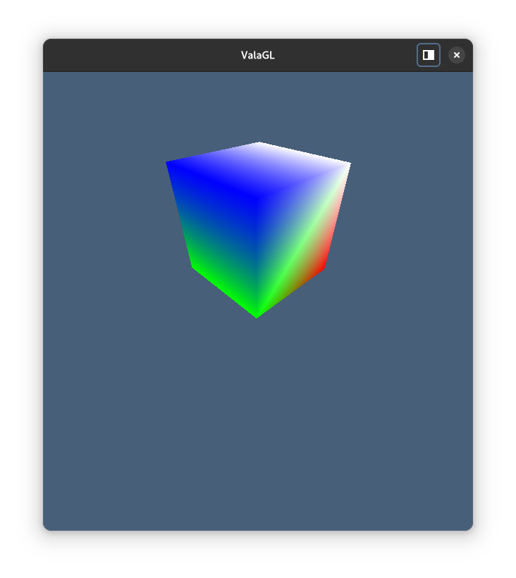

# ValaGL

Differences from [SpikedPaladin/valaGL](https://github.com/SpikedPaladin/valaGL)

* Refactored to use [m-shinder/libepoxy](https://github.com/m-shinder/libepoxy)
* Fixed types for the sake of readability and type safety
* Removed SDL references

Fork of [Maia-Everett/valagl](https://github.com/Maia-Everett/valagl)

* Refactored & Rewriten to meson build system
* Fixed warnings
* Loading shaders with [GLib.Resource](https://valadoc.org/gio-2.0/GLib.Resource.html)

## Installation

#### Dependencies
* libepoxy-vala
* glib

#### Build manualy

    $ meson setup --prefix=/usr build
    $ cd build
    $ ninja install
